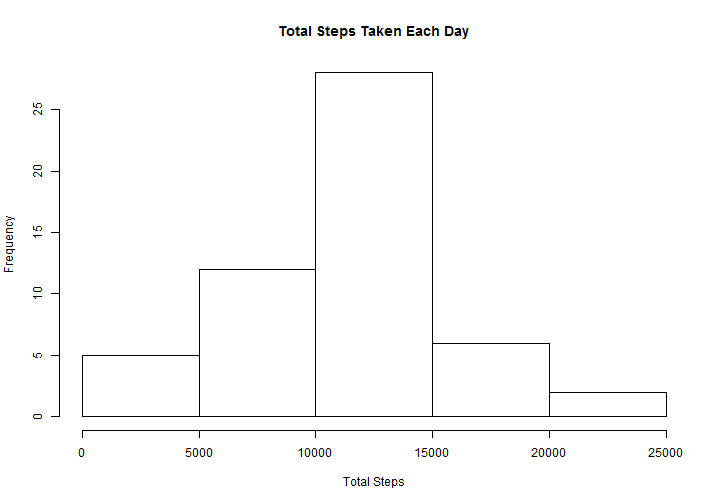
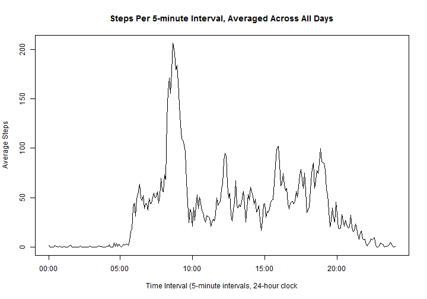
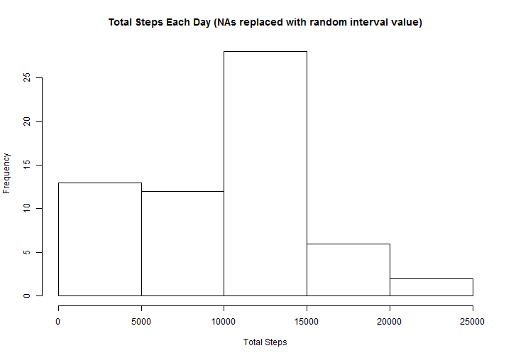
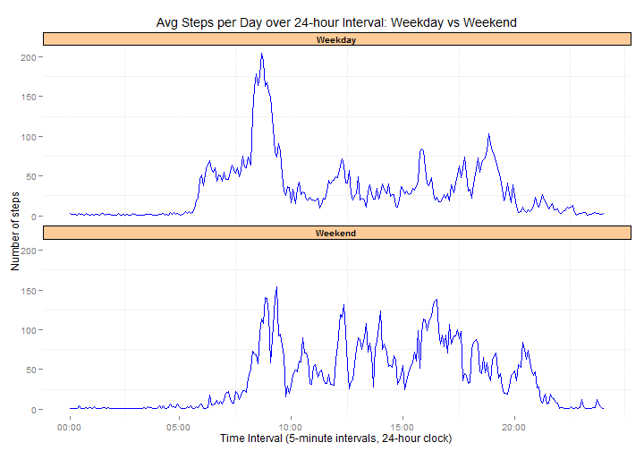

  
# Reproducible Research: Peer Assessment 1
## ***Author:  DatSci01***

## Loading and preprocessing the data

The data zipfile is available in the GitHub directory. The following code unzips the data file and reads the resulting .csv file to produce the "activity" data object.


```r
options(scipen=2,digits=2)
unzip("activity.zip")
activity<-read.csv("activity.csv",stringsAsFactors=T)
```

## What is mean total number of steps taken per day?

After aggregating the total steps by date, this histogram shows the frequency of total number of steps taken per day.


```r
## aggregate total steps by date
aggTotSteps<-aggregate(steps~date,data=activity,sum)
## produce histogram
hist(aggTotSteps$steps,main="Total Steps Taken Each Day",xlab="Total Steps")
```

 

```r
## calculate the mean and median steps
meanSteps<-round(mean(aggTotSteps$steps),4)
medianSteps<-median(aggTotSteps$steps)
```
The mean of the total steps taken per day is **10766.19**, while the median is **10765**.

## What is the average daily activity pattern?
The following plot of the daily 5-minute intervals measured shows the average number of steps taken in each interval, averaged across all days reported.


```r
## aggregate mean of steps for all dates for each interval
aggAvgSteps<-aggregate(steps~interval,data=activity,mean)
## produce line plot with custom x scale to better represent the intervals
timeTicks<-seq(from=0,to=2000, by=500)
plot(aggAvgSteps$interval,aggAvgSteps$steps,type="l",
     main="Steps Per 5-minute Interval, Averaged Across All Days",
     xlab="Time Interval (5-minute intervals, 24-hour clock",ylab="Average Steps",
     xaxt="n")
axis(1,at=timeTicks,labels=c("00:00","05:00","10:00","15:00","20:00"))
```

 

```r
## use aggregated data to find max value
maxInterval<-aggAvgSteps[aggAvgSteps$steps==max(aggAvgSteps$steps),]
```
Averaged across all days in the dataset, time interval **835** contains the maximum number of steps (**206.17 steps**).

## Imputing missing values

```r
valNA<-nrow(activity[!complete.cases(activity),])
```
There are **2304** observations (rows) with missing values in the dataset.

Exploring the portion of the data file with NA values, it is apparent that all the NA values are for 8 complete days where no step data is available. As a result, the two strategies suggested in the readme file were not good solutions. The first strategy, replacing specific time interval NA values with the mean value of the same time interval across the reported days, essentially doesn't change anything (other than add more data to the calulations), because it simply adds days with the mean value for each interval. This results in the same overall mean as the data with NA values, and the median changes only slightly. The other strategy suggested, to replace NA values with the mean of the values for the same date, also accomplished nothing, since entire days had NA values and thus the day's mean to be used would be NA as well.  

The strategy I adopted for this project was to replace missing interval values with a random value calulated using the mean and standard deviation of the available values for that specific interval, using a specified seed (so the results can be duplicated). The following histogram shows the data with NAs replaced using this strategy.

```r
## aggregate standard deviation step data by interval
aggSDSteps<-aggregate(steps~interval,data=activity,sd)
## set the random generator seed
set.seed(123666)

## correct the activity data by replacing NA values with the mean for the interval
activity[!complete.cases(activity),1]<-
     rnorm(1,
     aggAvgSteps[match(activity[!complete.cases(activity),3],
                       aggAvgSteps$interval),2],
     aggSDSteps[match(activity[!complete.cases(activity),3],
                       aggSDSteps$interval),2])
## aggregate and plot the data     
aggTotCorrectedIntSteps<-aggregate(steps~date,data=activity,sum)
hist(aggTotCorrectedIntSteps$steps,
     main="Total Steps Each Day (NAs replaced with random interval value)",xlab="Total Steps")
```

 

```r
## calculate mean and median of total steps replaced with random values based on the
## interval mean and std dev (aggTotCorrectedIntSteps)
meanCorrectedIntSteps<-mean(aggTotCorrectedIntSteps$steps)
medianCorrectedIntSteps<-median(aggTotCorrectedIntSteps$steps)
```
This correction strategy (for this specific example, using this seed) results in a mean of **9678.71** and a median of **10395**. This is a difference in the mean of **1087.48 steps (10.1%)** and a difference in the median of **370 steps (3.44%)**. While the magnitude of these differences may change some in multiple trials (using different seeds), I expect the actual difference to be near these results (as I found by executing this code multiple times with varying seeds).  Thus, **this suggests that the missing data could have a fairly large effect on the results of the analysis**.


## Are there differences in activity patterns between weekdays and weekends?

Using the data corrected by replacing NAs with random interval values, the following plot (requires the *ggplot2* library) shows the difference in activity patterns between weekdays and weekends. To generate this plot, the date variable in the corrected data file was changed from *character* to *date* and an additional variable was added to identify which date observations were weekdays (Mon-Fri) or weekend days (Sat-Sun). This additional variable was made into a factor.

```r
## change date variable type from "chr" to "date" so weekdays() function can be used
activity$date<-as.Date(activity$date,"%Y-%m-%d")
## Add variable with factors of weekday or weekend
activity$wday<-
     as.factor(ifelse(weekdays(activity$date) %in% 
                           c("Saturday","Sunday"), "Weekend", "Weekday"))

## aggregate mean of steps for all weekdays for each interval
aggAvgWdaySteps<-aggregate(steps~interval,
                           data=activity[activity$wday=="Weekday",],mean)
aggAvgWdaySteps$Dtype<-"Weekday"
## aggregate mean of steps for all weekend days for each interval
aggAvgWendSteps<-aggregate(steps~interval,
                           data=activity[activity$wday=="Weekend",],mean)
aggAvgWendSteps$Dtype<-"Weekend"
## combine two aggregate files into a single data file
aggAvgAllDaysSteps<-rbind(aggAvgWdaySteps,aggAvgWendSteps)


library(ggplot2)

## Create separate plots for weekday and weekend step totals
g<-ggplot(aggAvgAllDaysSteps,aes(x=interval,y=steps))
print(g
      +geom_line(col="blue") 
      + facet_wrap(~Dtype,ncol=1)
      +labs(y="Number of steps",x="Time Interval (5-minute intervals, 24-hour clock)")
      +theme(strip.background = element_rect(color="black",fill="#FFCC99"),
             strip.text.x = element_text(face="bold"))
      +theme(panel.background = element_rect(fill = 'white'))
      +scale_x_continuous(limits=c(0,2355),breaks=c(0,500,1000,1500,2000),
                          labels=c("00:00","05:00","10:00","15:00","20:00"))
       +ggtitle(expression(paste('Avg Steps per Day over 24-hour Interval: Weekday vs Weekend')))

)
```

 

**The plot suggests a weekday step pattern concentrated in the morning hours, while weekend activity tends to be spread more evenly, morning thru early evening.**


```r
## remove data file
unlink("activity.csv")
```
